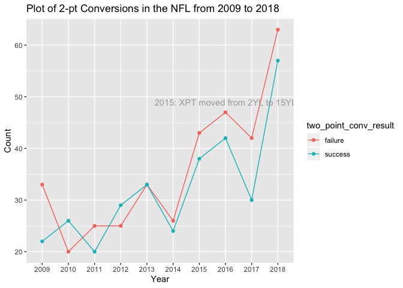
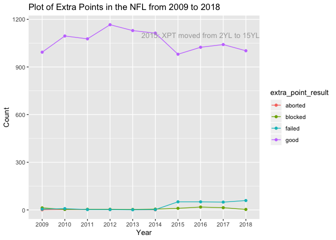
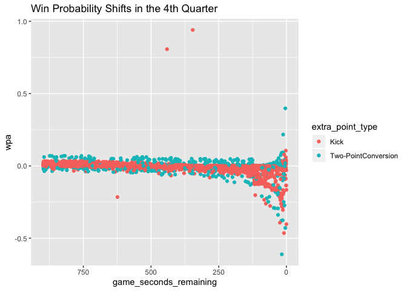
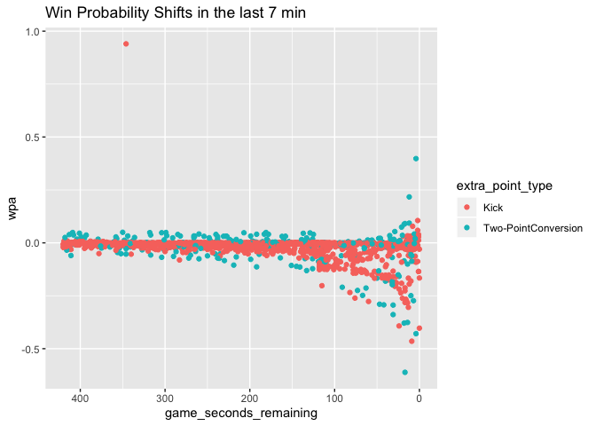
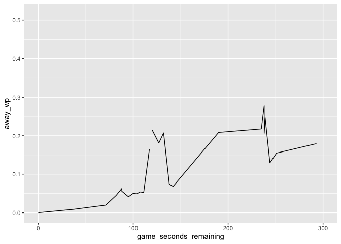

Loading the libraries needed
============================

    rm(list = ls())

    library(data.table)
    library(tidyverse)

    ## ── Attaching packages ────────────────────────────────────────────────────────────────────── tidyverse 1.3.0 ──

    ## ✓ ggplot2 3.2.1     ✓ purrr   0.3.3
    ## ✓ tibble  2.1.3     ✓ dplyr   0.8.3
    ## ✓ tidyr   1.0.2     ✓ stringr 1.4.0
    ## ✓ readr   1.3.1     ✓ forcats 0.4.0

    ## ── Conflicts ───────────────────────────────────────────────────────────────────────── tidyverse_conflicts() ──
    ## x dplyr::between()   masks data.table::between()
    ## x dplyr::filter()    masks stats::filter()
    ## x dplyr::first()     masks data.table::first()
    ## x dplyr::lag()       masks stats::lag()
    ## x dplyr::last()      masks data.table::last()
    ## x purrr::transpose() masks data.table::transpose()

    library(ggrepel)
    library(broom)

Background about the data
=========================

Our project covers [NFL play-by-play data from 2009 to 2018 from
Kaggle](https://www.kaggle.com/maxhorowitz/nflplaybyplay2009to2016), and
we are using betting data from Kaggle (link to data here) to
contextualize the play-by-play data.     The [extra point yard
line was
moved](http://www.nfl.com/news/story/0ap3000000493347/article/nfl-moves-extra-point-to-15yard-line-for-2015-season)
from the 2-yardline to the 15-yardline in 2015 because the NFL wanted to
increase the number of 2-point conversion attempts to boast ratings. We
want to analyze how attempting more 2-point conversions, especially in
the 4th quarter, can benefit teams.

Data Cleaning
=============

[Follow this link for using an open source Git extension to deal with
versioning large files.](https://git-lfs.github.com/) This is how we
were able to load the large play-by-play dataset.

    nfl_data <-  read_csv("NFLPlaybyPlay 2009-2018.csv")

    ## Parsed with column specification:
    ## cols(
    ##   .default = col_double(),
    ##   home_team = col_character(),
    ##   away_team = col_character(),
    ##   posteam = col_character(),
    ##   posteam_type = col_character(),
    ##   defteam = col_character(),
    ##   side_of_field = col_character(),
    ##   game_date = col_date(format = ""),
    ##   game_half = col_character(),
    ##   time = col_time(format = ""),
    ##   yrdln = col_character(),
    ##   desc = col_character(),
    ##   play_type = col_character(),
    ##   pass_length = col_character(),
    ##   pass_location = col_character(),
    ##   run_location = col_character(),
    ##   run_gap = col_character(),
    ##   field_goal_result = col_character(),
    ##   extra_point_result = col_character(),
    ##   two_point_conv_result = col_character(),
    ##   timeout_team = col_character()
    ##   # ... with 88 more columns
    ## )

    ## See spec(...) for full column specifications.

    ## Warning: 3240 parsing failures.
    ##  row                                col           expected      actual                          file
    ## 1081 pass_defense_2_player_id           1/0/T/F/TRUE/FALSE 00-0025828  'NFLPlaybyPlay 2009-2018.csv'
    ## 1081 pass_defense_2_player_name         1/0/T/F/TRUE/FALSE W.Woodyard  'NFLPlaybyPlay 2009-2018.csv'
    ## 1619 forced_fumble_player_2_team        1/0/T/F/TRUE/FALSE MIA         'NFLPlaybyPlay 2009-2018.csv'
    ## 1619 forced_fumble_player_2_player_id   1/0/T/F/TRUE/FALSE 00-0023408  'NFLPlaybyPlay 2009-2018.csv'
    ## 1619 forced_fumble_player_2_player_name 1/0/T/F/TRUE/FALSE G.Camarillo 'NFLPlaybyPlay 2009-2018.csv'
    ## .... .................................. .................. ........... .............................
    ## See problems(...) for more details.

    spread_data = read.csv("spreadspoke_scores.csv")
    spread_data$newdate <- strptime((spread_data$schedule_date), "%m/%d/%Y")
    spread_data$newdate = format(spread_data$newdate, "%Y-%m-%d")
    spread_data$newdate = as.Date(as.character(spread_data$newdate))

    spread_data$home_team_abbv <- ifelse(spread_data$team_home=="Arizona Cardinals", "ARI",
                                         ifelse(spread_data$team_home=="Atlanta Falcons", "ATL", 
                                                ifelse(spread_data$team_home=="Baltimore Ravens", "BAL",
                                                       ifelse(spread_data$team_home=="Buffalo Bills", "BUF",
                                                              ifelse(spread_data$team_home=="Carolina Panthers", "CAR",
                                  ifelse(spread_data$team_home=="Chicago Bears", "CHI",
                                          ifelse(spread_data$team_home=="Cincinnati Bengals", "CIN",
                                                ifelse(spread_data$team_home=="Cleveland Browns", "CLE",
                                                       ifelse(spread_data$team_home=="Dallas Cowboys", "DAL",
                                                              ifelse(spread_data$team_home=="Denver Broncos", "DEN", 
                                  ifelse(spread_data$team_home=="Detroit Lions", "DET",
                                         ifelse(spread_data$team_home=="Green Bay Packers", "GB",
                                                ifelse(spread_data$team_home=="Houston Texans", "HOU",
                                                       ifelse(spread_data$team_home=="Indianapolis Colts", "IND",
                                  ifelse(spread_data$team_home=="Jacksonville Jaguars", "JAX",
                                         ifelse(spread_data$team_home=="Kansas City Chiefs", "KC",
                                                ifelse(spread_data$team_home=="Los Angeles Rams", "LA",
                                                       ifelse(spread_data$team_home=="Los Angeles Chargers", "LAC",
                                  ifelse(spread_data$team_home=="Miami Dolphins", "MIA",
                                         ifelse(spread_data$team_home=="Minnesota Vikings", "MIN",
                                                ifelse(spread_data$team_home=="New England Patriots", "NE",
                                                    ifelse(spread_data$team_home=="New Orleans Saints", "NO",
                                  ifelse(spread_data$team_home=="New York Giants", "NYG",
                                         ifelse(spread_data$team_home=="New York Jets", "NYJ",
                                                ifelse(spread_data$team_home=="Oakland Raiders", "OAK",
                                                       ifelse(spread_data$team_home=="Philadelphia Eagles", "PHI",
                                  ifelse(spread_data$team_home=="Pittsburgh Steelers", "PIT",
                                         ifelse(spread_data$team_home=="San Diego Chargers", "SD",
                                                ifelse(spread_data$team_home=="Seattle Seahawks", "SEA",
                                  ifelse(spread_data$team_home=="San Francisco 49ers", "SF",
                                         ifelse(spread_data$team_home=="St. Louis Rams", "STL",
                                                ifelse(spread_data$team_home=="Tampa Bay Buccaneers", "TB",
                                  ifelse(spread_data$team_home=="Tennessee Titans", "TEN",
                                         ifelse(spread_data$team_home=="Washington Redskins", "WAS", "NA"
                                                ))))))))))))))))))))))))))))))))))

    #Jacksonville's abbreviation changed from JAC to JAX in 2013
    nfl_data$home_team <- ifelse(nfl_data$home_team == "JAC", "JAX", nfl_data$home_team)

    colnames(spread_data)[19] <- "home_team"
    colnames(spread_data)[18] <- "game_date"
    glimpse(spread_data)

    ## Observations: 12,678
    ## Variables: 19
    ## $ schedule_date       <fct> 09/02/1966, 09/03/1966, 09/04/1966, 09/09/1966, 0…
    ## $ schedule_season     <int> 1966, 1966, 1966, 1966, 1966, 1966, 1966, 1966, 1…
    ## $ schedule_week       <fct> 1, 1, 1, 2, 1, 2, 2, 1, 2, 1, 1, 1, 1, 1, 2, 3, 2…
    ## $ schedule_playoff    <lgl> FALSE, FALSE, FALSE, FALSE, FALSE, FALSE, FALSE, …
    ## $ team_home           <fct> Miami Dolphins, Houston Oilers, San Diego Charger…
    ## $ score_home          <int> 14, 45, 27, 14, 24, 31, 24, 14, 20, 14, 34, 20, 1…
    ## $ score_away          <int> 23, 7, 7, 19, 3, 0, 0, 19, 42, 3, 34, 20, 13, 38,…
    ## $ team_away           <fct> Oakland Raiders, Denver Broncos, Buffalo Bills, N…
    ## $ team_favorite_id    <fct> , , , , , , , , , , , , , , , , , , , , , , , , , 
    ## $ spread_favorite     <dbl> NA, NA, NA, NA, NA, NA, NA, NA, NA, NA, NA, NA, N…
    ## $ over_under_line     <dbl> NA, NA, NA, NA, NA, NA, NA, NA, NA, NA, NA, NA, N…
    ## $ stadium             <fct> Orange Bowl, Rice Stadium, Balboa Stadium, Orange…
    ## $ stadium_neutral     <lgl> FALSE, FALSE, FALSE, FALSE, FALSE, FALSE, FALSE, …
    ## $ weather_temperature <int> 83, 81, 70, 82, 64, 77, 69, 71, 63, 67, 64, 60, 7…
    ## $ weather_wind_mph    <int> 6, 7, 7, 11, 8, 6, 9, 7, 11, 7, 5, 25, 5, 8, 10, …
    ## $ weather_humidity    <fct> 71, 70, 82, 78, 62, 82, 81, 57, 73, 73, 70, 75, 7…
    ## $ weather_detail      <fct> , , , , , , , , , , , , , , , , , , , , , , , , , 
    ## $ game_date           <date> 1966-09-02, 1966-09-03, 1966-09-04, 1966-09-09, …
    ## $ home_team           <chr> "MIA", "NA", "SD", "MIA", "GB", "NA", "SD", "ATL"…

    nfl_data <- nfl_data %>% 
                    left_join(spread_data, by=c("game_date", "home_team"))

    post_td_plays <- nfl_data %>% 
      select(play_id,
             game_id,
             home_team,
             away_team,
             posteam,
             posteam_type,
             defteam,
             posteam_score,
             defteam_score,
             score_differential,
             posteam_score_post,
             defteam_score_post,
             score_differential_post,
             desc,
             game_date,
             qtr,
             game_seconds_remaining,
             play_type,
             yards_gained,
             contains("two_point"),
             kicker_player_name,
             kicker_player_id,
             blocked_player_id,
             blocked_player_name,
             contains("extra_point"),
             wp,
             def_wp,
             home_wp,
             away_wp,
             wpa,
             home_wp_post,
             away_wp_post,
             ydsnet, 
             ep, 
             epa,
             shotgun,
             qb_dropback,
             team_favorite_id, 
             spread_favorite, 
             over_under_line, 
             stadium,
             stadium_neutral, 
             weather_temperature,
             weather_wind_mph,
             weather_humidity,
             weather_detail)%>% 
      mutate(year = substr(game_id, 1, 4)) %>%
      filter(extra_point_attempt == 1 | two_point_attempt == 1 | defensive_extra_point_attempt == 1 | defensive_two_point_attempt == 1)

    post_td_plays$home_team <- as.factor(as.character(post_td_plays$home_team))
    post_td_plays$away_team <- as.factor(as.character(post_td_plays$away_team))
    post_td_plays$team_favorite_id <- as.factor(as.character(post_td_plays$team_favorite_id))

    #Create one column that separates the types of extra point(s) try
    post_td_plays <- post_td_plays %>% 
      mutate(extra_point_type = ifelse(extra_point_attempt == 1,
                                   "Kick", "Two-PointConversion"))

    #str(post_td_plays)
    post_td_plays$posteam <- as.factor(post_td_plays$posteam)
    post_td_plays$defteam <- as.factor(post_td_plays$defteam)
    post_td_plays$play_type <- as.factor(post_td_plays$play_type)
    post_td_plays$two_point_attempt <- as.factor(post_td_plays$two_point_attempt)
    post_td_plays$two_point_conv_result <- as.factor(post_td_plays$two_point_conv_result)
    post_td_plays$kicker_player_id <- as.factor(post_td_plays$kicker_player_id)
    post_td_plays$extra_point_attempt <- as.factor(post_td_plays$extra_point_attempt)
    post_td_plays$extra_point_result <- as.factor(post_td_plays$extra_point_result)
    post_td_plays$year <- as.factor(post_td_plays$year)
    post_td_plays$weather_humidity <- as.numeric(as.character(post_td_plays$weather_humidity))
    glimpse(post_td_plays)

    ## Observations: 11,846
    ## Variables: 56
    ## $ play_id                       <dbl> 1805, 1926, 943, 2213, 2624, 3453, 4012…
    ## $ game_id                       <dbl> 2009091000, 2009091000, 2009091304, 200…
    ## $ home_team                     <fct> PIT, PIT, CLE, CLE, CLE, CLE, CLE, NO, …
    ## $ away_team                     <fct> TEN, TEN, MIN, MIN, MIN, MIN, MIN, DET,…
    ## $ posteam                       <fct> PIT, TEN, MIN, MIN, MIN, MIN, CLE, NO, …
    ## $ posteam_type                  <chr> "home", "away", "away", "away", "away",…
    ## $ defteam                       <fct> TEN, PIT, CLE, CLE, CLE, CLE, MIN, DET,…
    ## $ posteam_score                 <dbl> 6, 6, 9, 16, 23, 33, 18, 6, 13, 9, 20, …
    ## $ defteam_score                 <dbl> 0, 7, 3, 12, 12, 12, 34, 0, 0, 14, 10, …
    ## $ score_differential            <dbl> 6, -1, 6, 4, 11, 21, -16, 6, 13, -5, 10…
    ## $ posteam_score_post            <dbl> 7, 7, 10, 17, 24, 34, 19, 7, 14, 10, 21…
    ## $ defteam_score_post            <dbl> 0, 7, 3, 12, 12, 12, 34, 0, 0, 14, 10, …
    ## $ score_differential_post       <dbl> 7, 0, 7, 5, 12, 22, -15, 7, 14, -4, 11,…
    ## $ desc                          <chr> "J.Reed extra point is GOOD, Center-G.W…
    ## $ game_date                     <date> 2009-09-10, 2009-09-10, 2009-09-13, 20…
    ## $ qtr                           <dbl> 2, 2, 2, 3, 3, 4, 4, 1, 1, 2, 2, 2, 3, …
    ## $ game_seconds_remaining        <dbl> 1882, 1848, 2469, 1507, 966, 358, 28, 3…
    ## $ play_type                     <fct> extra_point, extra_point, extra_point, …
    ## $ yards_gained                  <dbl> 0, 0, 0, 0, 0, 0, 0, 0, 0, 0, 0, 0, 0, …
    ## $ two_point_conv_result         <fct> NA, NA, NA, NA, NA, NA, NA, NA, NA, NA,…
    ## $ two_point_conversion_prob     <dbl> 0, 0, 0, 0, 0, 0, 0, 0, 0, 0, 0, 0, 0, …
    ## $ two_point_attempt             <fct> 0, 0, 0, 0, 0, 0, 0, 0, 0, 0, 0, 0, 0, …
    ## $ defensive_two_point_attempt   <dbl> 0, 0, 0, 0, 0, 0, 0, 0, 0, 0, 0, 0, 0, …
    ## $ defensive_two_point_conv      <dbl> 0, 0, 0, 0, 0, 0, 0, 0, 0, 0, 0, 0, 0, …
    ## $ kicker_player_name            <chr> "J.Reed", "R.Bironas", "R.Longwell", "R…
    ## $ kicker_player_id              <fct> 00-0020737, 00-0020962, 00-0010072, 00-…
    ## $ blocked_player_id             <chr> NA, NA, NA, NA, NA, NA, NA, NA, NA, NA,…
    ## $ blocked_player_name           <chr> NA, NA, NA, NA, NA, NA, NA, NA, NA, NA,…
    ## $ extra_point_result            <fct> good, good, good, good, good, good, goo…
    ## $ extra_point_prob              <dbl> 0.9907954, 0.9907954, 0.9907954, 0.9907…
    ## $ extra_point_attempt           <fct> 1, 1, 1, 1, 1, 1, 1, 1, 1, 1, 1, 1, 1, …
    ## $ defensive_extra_point_attempt <dbl> 0, 0, 0, 0, 0, 0, 0, 0, 0, 0, 0, 0, 0, …
    ## $ defensive_extra_point_conv    <dbl> 0, 0, 0, 0, 0, 0, 0, 0, 0, 0, 0, 0, 0, …
    ## $ wp                            <dbl> 0.738386138, 0.500337949, 0.709899136, …
    ## $ def_wp                        <dbl> 0.261613862, 0.499662051, 0.290100864, …
    ## $ home_wp                       <dbl> 0.738386138, 0.499662051, 0.290100864, …
    ## $ away_wp                       <dbl> 0.26161386, 0.50033795, 0.70989914, 0.6…
    ## $ wpa                           <dbl> -2.263589e-02, -1.952935e-02, 2.064852e…
    ## $ home_wp_post                  <dbl> 0.715750253, 0.519191406, 0.269452339, …
    ## $ away_wp_post                  <dbl> 0.28424975, 0.48080859, 0.73054766, 0.6…
    ## $ ydsnet                        <dbl> 79, 71, 23, 55, 82, 64, 80, 54, 53, 13,…
    ## $ ep                            <dbl> 0.9907954, 0.9907954, 0.9907954, 0.9907…
    ## $ epa                           <dbl> 0.0092046, 0.0092046, 0.0092046, 0.0092…
    ## $ shotgun                       <dbl> 0, 0, 0, 0, 0, 0, 0, 0, 0, 0, 0, 0, 0, …
    ## $ qb_dropback                   <dbl> 0, 0, 0, 0, 0, 0, 0, 0, 0, 0, 0, 0, 0, …
    ## $ team_favorite_id              <fct> PIT, PIT, MIN, MIN, MIN, MIN, MIN, NO, …
    ## $ spread_favorite               <dbl> -6.5, -6.5, -4.5, -4.5, -4.5, -4.5, -4.…
    ## $ over_under_line               <dbl> 35, 35, 40, 40, 40, 40, 40, 50, 50, 50,…
    ## $ stadium                       <fct> Heinz Field, Heinz Field, FirstEnergy S…
    ## $ stadium_neutral               <lgl> FALSE, FALSE, FALSE, FALSE, FALSE, FALS…
    ## $ weather_temperature           <int> 67, 67, 70, 70, 70, 70, 70, 72, 72, 72,…
    ## $ weather_wind_mph              <int> 9, 9, 4, 4, 4, 4, 4, 0, 0, 0, 0, 0, 0, …
    ## $ weather_humidity              <dbl> 64, 64, 71, 71, 71, 71, 71, NA, NA, NA,…
    ## $ weather_detail                <fct> , , , , , , , DOME, DOME, DOME, DOME, D…
    ## $ year                          <fct> 2009, 2009, 2009, 2009, 2009, 2009, 200…
    ## $ extra_point_type              <chr> "Kick", "Kick", "Kick", "Kick", "Kick",…

    #Dropping the no_play play type from the data...it's all penalties
    post_td_plays <- post_td_plays %>% 
      filter(play_type != "no_play")

    # Ratio of XPT:2PT attempts
    post_td_plays %>% 
      group_by(year, extra_point_attempt, two_point_attempt) %>% 
      summarise(n = n())

    ## # A tibble: 20 x 4
    ## # Groups:   year, extra_point_attempt [20]
    ##    year  extra_point_attempt two_point_attempt     n
    ##    <fct> <fct>               <fct>             <int>
    ##  1 2009  0                   1                    55
    ##  2 2009  1                   0                  1012
    ##  3 2010  0                   1                    46
    ##  4 2010  1                   0                  1109
    ##  5 2011  0                   1                    45
    ##  6 2011  1                   0                  1083
    ##  7 2012  0                   1                    54
    ##  8 2012  1                   0                  1174
    ##  9 2013  0                   1                    66
    ## 10 2013  1                   0                  1133
    ## 11 2014  0                   1                    50
    ## 12 2014  1                   0                  1121
    ## 13 2015  0                   1                    81
    ## 14 2015  1                   0                  1041
    ## 15 2016  0                   1                    89
    ## 16 2016  1                   0                  1093
    ## 17 2017  0                   1                    72
    ## 18 2017  1                   0                  1104
    ## 19 2018  0                   1                   120
    ## 20 2018  1                   0                  1064

    #Mean WPA change based on play type for post-touchdown 
    post_td_plays %>% 
      group_by(play_type) %>% 
      summarise(mean(wpa, na.rm = T))

    ## # A tibble: 3 x 2
    ##   play_type   `mean(wpa, na.rm = T)`
    ##   <fct>                        <dbl>
    ## 1 extra_point              -0.000472
    ## 2 pass                     -0.0106  
    ## 3 run                      -0.00100

Data Visualization
==================

    # 2-pt Conversion Distribution
    post_td_plays %>% 
      filter(two_point_attempt == 1) %>% 
      group_by(year, two_point_conv_result) %>% 
      summarise(n = n()) %>% 
      ggplot(aes(x = year, y = n, group = two_point_conv_result)) +
      geom_line(aes(color = two_point_conv_result)) +
      geom_point(aes(color = two_point_conv_result)) +
      annotate(geom="text", x='2016', y=49, label="2015: XPT moved from 2YL to 15YL", color="darkgray") +
      labs(title="Plot of 2-pt Conversions in the NFL from 2009 to 2018",x="Year", y = "Count")

    # XPT Conversion Distribution
    post_td_plays %>% 
      filter(extra_point_attempt == 1) %>% 
      group_by(year, extra_point_result) %>% 
      summarise(n = n()) %>% 
      ggplot(aes(x = year, y = n, group = extra_point_result)) +
      geom_line(aes(color = extra_point_result)) +
      geom_point(aes(color = extra_point_result)) +
      annotate(geom="text", x='2016', y=1100, label="2015: XPT moved from 2YL to 15YL", color="darkgray") +
      labs(title="Plot of Extra Points in the NFL from 2009 to 2018", x="Year", y = "Count")

    #Graph 4th quarter win probability changes based on type of extra point try
    post_td_plays %>% 
      filter(qtr == 4) %>% 
      ggplot(., aes(x=game_seconds_remaining, y=wpa, 
                                     color=extra_point_type)) + geom_point() + scale_x_reverse() +
      ggtitle("Win Probability Shifts in the 4th Quarter")

    ## Warning: Removed 86 rows containing missing values (geom_point).

    #Graph 4th quarter, 7 minutes left win probability changes based on type of extra point try
    post_td_plays %>% 
      filter(qtr == 4, game_seconds_remaining <= 420) %>% 
      ggplot(., aes(x=game_seconds_remaining, y=wpa, 
                    color=extra_point_type)) + geom_point() + scale_x_reverse()  +
      ggtitle("Win Probability Shifts in the last 7 min")

    ## Warning: Removed 67 rows containing missing values (geom_point).

Data Modeling
=============

    # mod1 <- lm(wpa ~ posteam + defteam + score_differential + play_type + two_point_attempt + two_point_conv_result + kicker_player_id + extra_point_attempt + extra_point_result + year, data = post_td_plays)

    #Regression to see influential factors for two-point conversions specifcially
    #Just a test, planning to further develop
    lm_twopoint <- post_td_plays %>% 
      lm(wp ~ game_seconds_remaining + score_differential + extra_point_type + weather_temperature + spread_favorite + over_under_line, data = .)

    summary(lm_twopoint)

    ## 
    ## Call:
    ## lm(formula = wp ~ game_seconds_remaining + score_differential + 
    ##     extra_point_type + weather_temperature + spread_favorite + 
    ##     over_under_line, data = .)
    ## 
    ## Residuals:
    ##      Min       1Q   Median       3Q      Max 
    ## -0.87303 -0.04676  0.01493  0.04704  0.63986 
    ## 
    ## Coefficients:
    ##                                       Estimate Std. Error t value Pr(>|t|)    
    ## (Intercept)                          5.269e-01  1.046e-02  50.376  < 2e-16 ***
    ## game_seconds_remaining               1.463e-05  9.685e-07  15.105  < 2e-16 ***
    ## score_differential                   2.332e-02  8.844e-05 263.704  < 2e-16 ***
    ## extra_point_typeTwo-PointConversion -1.214e-02  4.227e-03  -2.872  0.00409 ** 
    ## weather_temperature                  5.773e-05  6.219e-05   0.928  0.35325    
    ## spread_favorite                      6.729e-04  2.794e-04   2.408  0.01606 *  
    ## over_under_line                     -4.362e-04  2.139e-04  -2.040  0.04140 *  
    ## ---
    ## Signif. codes:  0 '***' 0.001 '**' 0.01 '*' 0.05 '.' 0.1 ' ' 1
    ## 
    ## Residual standard error: 0.1026 on 11600 degrees of freedom
    ##   (5 observations deleted due to missingness)
    ## Multiple R-squared:  0.8647, Adjusted R-squared:  0.8647 
    ## F-statistic: 1.236e+04 on 6 and 11600 DF,  p-value: < 2.2e-16

    #Success Rate of Extra Points (2015 and forward)
    post_td_plays %>% 
      filter(extra_point_type == "Kick",
             year == "2015" | year == "2016" | year == "2017" | year == "2018") %>% 
      summarise(Extra_Point_Success = mean(extra_point_result == "good"))

    ## # A tibble: 1 x 1
    ##   Extra_Point_Success
    ##                 <dbl>
    ## 1               0.941

    #.9407 success rate

    #Success Rate of Two Points
    post_td_plays %>% 
      filter(extra_point_type == "Two-PointConversion") %>% 
      summarise(Two_Point_Success = mean(two_point_conv_result == "success"))

    ## # A tibble: 1 x 1
    ##   Two_Point_Success
    ##               <dbl>
    ## 1             0.473

    #.47345 success rate

    #10 minutes left, down 15, est change in probability for extra point 
    hypothetical_situation <- data.frame(game_seconds_remaining = 600, score_differential = -15, extra_point_type = "Kick", weather_temperature = 60, spread_favorite = -6, over_under_line = 30)
    kick_down15 <- predict(lm_twopoint, newdata = hypothetical_situation)

    #10 minutes left, down 15, est change in probability for extra point
    hypothetical_situation <- data.frame(game_seconds_remaining = 600, score_differential = -15, extra_point_type = "Two-PointConversion", weather_temperature = 60, spread_favorite = -6, over_under_line = 30)
    twopt_down15 <- predict(lm_twopoint, newdata = hypothetical_situation)

    #10 minutes left, down 14, est change in probability for extra point 
    hypothetical_situation <- data.frame(game_seconds_remaining = 600, score_differential = -14, extra_point_type = "Kick", weather_temperature = 60, spread_favorite = -6, over_under_line = 30)
    kick_down14 <- predict(lm_twopoint, newdata = hypothetical_situation)

    #10 minutes left, down 14, est change in probability for extra point
    hypothetical_situation <- data.frame(game_seconds_remaining = 600, score_differential = -14, extra_point_type = "Two-PointConversion", weather_temperature = 60, spread_favorite = -6, over_under_line = 30)
    twopt_down14 <- predict(lm_twopoint, newdata = hypothetical_situation)

    #10 minutes left, down 13, est change in probability for extra point 
    hypothetical_situation <- data.frame(game_seconds_remaining = 600, score_differential = -13, extra_point_type = "Kick", weather_temperature = 60, spread_favorite = -6, over_under_line = 30)
    kick_down13 <- predict(lm_twopoint, newdata = hypothetical_situation)

    #10 minutes left, down 13, est change in probability for extra point
    hypothetical_situation <- data.frame(game_seconds_remaining = 600, score_differential = -13, extra_point_type = "Two-PointConversion", weather_temperature = 60, spread_favorite = -6, over_under_line = 30)
    twopt_down13 <- predict(lm_twopoint, newdata = hypothetical_situation)

    #10 minutes left, down 12, est change in probability for extra point 
    hypothetical_situation <- data.frame(game_seconds_remaining = 600, score_differential = -12, extra_point_type = "Kick", weather_temperature = 60, spread_favorite = -6, over_under_line = 30)
    kick_down12 <- predict(lm_twopoint, newdata = hypothetical_situation)

    #10 minutes left, down 12, est change in probability for extra point
    hypothetical_situation <- data.frame(game_seconds_remaining = 600, score_differential = -12, extra_point_type = "Two-PointConversion", weather_temperature = 60, spread_favorite = -6, over_under_line = 30)
    twopt_down12 <- predict(lm_twopoint, newdata = hypothetical_situation)

    #10 minutes left, down 11, est change in probability for extra point 
    hypothetical_situation <- data.frame(game_seconds_remaining = 600, score_differential = -11, extra_point_type = "Kick", weather_temperature = 60, spread_favorite = -6, over_under_line = 30)
    kick_down11 <- predict(lm_twopoint, newdata = hypothetical_situation)

    #10 minutes left, down 11, est change in probability for extra point
    hypothetical_situation <- data.frame(game_seconds_remaining = 600, score_differential = -11, extra_point_type = "Two-PointConversion", weather_temperature = 60, spread_favorite = -6, over_under_line = 30)
    twopt_down11 <- predict(lm_twopoint, newdata = hypothetical_situation)

    #10 minutes left, down 10, est change in probability for extra point 
    hypothetical_situation <- data.frame(game_seconds_remaining = 600, score_differential = -10, extra_point_type = "Kick", weather_temperature = 60, spread_favorite = -6, over_under_line = 30)
    kick_down10 <- predict(lm_twopoint, newdata = hypothetical_situation)

    #10 minutes left, down 10, est change in probability for extra point
    hypothetical_situation <- data.frame(game_seconds_remaining = 600, score_differential = -10, extra_point_type = "Two-PointConversion", weather_temperature = 60, spread_favorite = -6, over_under_line = 30)
    twopt_down10 <- predict(lm_twopoint, newdata = hypothetical_situation)

    #10 minutes left, down 9, est change in probability for extra point 
    hypothetical_situation <- data.frame(game_seconds_remaining = 600, score_differential = -9, extra_point_type = "Kick", weather_temperature = 60, spread_favorite = -6, over_under_line = 30)
    kick_down9 <- predict(lm_twopoint, newdata = hypothetical_situation)

    #10 minutes left, down 9, est change in probability for extra point
    hypothetical_situation <- data.frame(game_seconds_remaining = 600, score_differential = -9, extra_point_type = "Two-PointConversion", weather_temperature = 60, spread_favorite = -6, over_under_line = 30)
    twopt_down9 <- predict(lm_twopoint, newdata = hypothetical_situation)

    #10 minutes left, down 8, est change in probability for extra point 
    hypothetical_situation <- data.frame(game_seconds_remaining = 600, score_differential = -8, extra_point_type = "Kick", weather_temperature = 60, spread_favorite = -6, over_under_line = 30)
    kick_down8 <- predict(lm_twopoint, newdata = hypothetical_situation)

    #10 minutes left, down 8, est change in probability for extra point
    hypothetical_situation <- data.frame(game_seconds_remaining = 600, score_differential = -8, extra_point_type = "Two-PointConversion", weather_temperature = 60, spread_favorite = -6, over_under_line = 30)
    twopt_down8 <- predict(lm_twopoint, newdata = hypothetical_situation)

    #10 minutes left, down 7, est change in probability for extra point 
    hypothetical_situation <- data.frame(game_seconds_remaining = 600, score_differential = -7, extra_point_type = "Kick", weather_temperature = 60, spread_favorite = -6, over_under_line = 30)
    kick_down7 <- predict(lm_twopoint, newdata = hypothetical_situation)

    #10 minutes left, down 7, est change in probability for extra point
    hypothetical_situation <- data.frame(game_seconds_remaining = 600, score_differential = -7, extra_point_type = "Two-PointConversion", weather_temperature = 60, spread_favorite = -6, over_under_line = 30)
    twopt_down7 <- predict(lm_twopoint, newdata = hypothetical_situation)

    #10 minutes left, down 6, est change in probability for extra point 
    hypothetical_situation <- data.frame(game_seconds_remaining = 600, score_differential = -6, extra_point_type = "Kick", weather_temperature = 60, spread_favorite = -6, over_under_line = 30)
    kick_down6 <- predict(lm_twopoint, newdata = hypothetical_situation)

    #10 minutes left, down 6, est change in probability for extra point
    hypothetical_situation <- data.frame(game_seconds_remaining = 600, score_differential = -6, extra_point_type = "Two-PointConversion", weather_temperature = 60, spread_favorite = -6, over_under_line = 30)
    twopt_down6 <- predict(lm_twopoint, newdata = hypothetical_situation)

    #10 minutes left, down 5, est change in probability for extra point 
    hypothetical_situation <- data.frame(game_seconds_remaining = 600, score_differential = -5, extra_point_type = "Kick", weather_temperature = 60, spread_favorite = -6, over_under_line = 30)
    kick_down5 <- predict(lm_twopoint, newdata = hypothetical_situation)

    #10 minutes left, down 5, est change in probability for extra point
    hypothetical_situation <- data.frame(game_seconds_remaining = 600, score_differential = -5, extra_point_type = "Two-PointConversion", weather_temperature = 60, spread_favorite = -6, over_under_line = 30)
    twopt_down5 <- predict(lm_twopoint, newdata = hypothetical_situation)

    #10 minutes left, down 4, est change in probability for extra point 
    hypothetical_situation <- data.frame(game_seconds_remaining = 600, score_differential = -4, extra_point_type = "Kick", weather_temperature = 60, spread_favorite = -6, over_under_line = 30)
    kick_down4 <- predict(lm_twopoint, newdata = hypothetical_situation)

    #10 minutes left, down 4, est change in probability for extra point
    hypothetical_situation <- data.frame(game_seconds_remaining = 600, score_differential = -4, extra_point_type = "Two-PointConversion", weather_temperature = 60, spread_favorite = -6, over_under_line = 30)
    twopt_down4 <- predict(lm_twopoint, newdata = hypothetical_situation)

    #10 minutes left, down 3, est change in probability for extra point 
    hypothetical_situation <- data.frame(game_seconds_remaining = 600, score_differential = -3, extra_point_type = "Kick", weather_temperature = 60, spread_favorite = -6, over_under_line = 30)
    kick_down3 <- predict(lm_twopoint, newdata = hypothetical_situation)

    #10 minutes left, down 3, est change in probability for extra point
    hypothetical_situation <- data.frame(game_seconds_remaining = 600, score_differential = -3, extra_point_type = "Two-PointConversion", weather_temperature = 60, spread_favorite = -6, over_under_line = 30)
    twopt_down3 <- predict(lm_twopoint, newdata = hypothetical_situation)

    #10 minutes left, down 2, est change in probability for extra point 
    hypothetical_situation <- data.frame(game_seconds_remaining = 600, score_differential = -2, extra_point_type = "Kick", weather_temperature = 60, spread_favorite = -6, over_under_line = 30)
    kick_down2 <- predict(lm_twopoint, newdata = hypothetical_situation)

    #10 minutes left, down 2, est change in probability for extra point
    hypothetical_situation <- data.frame(game_seconds_remaining = 600, score_differential = -2, extra_point_type = "Two-PointConversion", weather_temperature = 60, spread_favorite = -6, over_under_line = 30)
    twopt_down2 <- predict(lm_twopoint, newdata = hypothetical_situation)

    #10 minutes left, down 1, est change in probability for extra point 
    hypothetical_situation <- data.frame(game_seconds_remaining = 600, score_differential = -1, extra_point_type = "Kick", weather_temperature = 60, spread_favorite = -6, over_under_line = 30)
    kick_down1 <- predict(lm_twopoint, newdata = hypothetical_situation)

    #10 minutes left, down 1, est change in probability for extra point
    hypothetical_situation <- data.frame(game_seconds_remaining = 600, score_differential = -1, extra_point_type = "Two-PointConversion", weather_temperature = 60, spread_favorite = -6, over_under_line = 30)
    twopt_down1 <- predict(lm_twopoint, newdata = hypothetical_situation)

    #10 minutes left, tied, est change in probability for extra point 
    hypothetical_situation <- data.frame(game_seconds_remaining = 600, score_differential = 0, extra_point_type = "Kick", weather_temperature = 60, spread_favorite = -6, over_under_line = 30)
    kick_tied <- predict(lm_twopoint, newdata = hypothetical_situation)

    #10 minutes left, tied, est change in probability for extra point
    hypothetical_situation <- data.frame(game_seconds_remaining = 600, score_differential = 0, extra_point_type = "Two-PointConversion", weather_temperature = 60, spread_favorite = -6, over_under_line = 30)
    twopt_tied <- predict(lm_twopoint, newdata = hypothetical_situation)

    #10 minutes left, up 1, est change in probability for extra point 
    hypothetical_situation <- data.frame(game_seconds_remaining = 600, score_differential = 1, extra_point_type = "Kick", weather_temperature = 60, spread_favorite = -6, over_under_line = 30)
    kick_up1 <- predict(lm_twopoint, newdata = hypothetical_situation)

    #10 minutes left, up 1, est change in probability for extra point
    hypothetical_situation <- data.frame(game_seconds_remaining = 600, score_differential = 1, extra_point_type = "Two-PointConversion", weather_temperature = 60, spread_favorite = -6, over_under_line = 30)
    twopt_up1 <- predict(lm_twopoint, newdata = hypothetical_situation)

    #10 minutes left, up 2, est change in probability for extra point 
    hypothetical_situation <- data.frame(game_seconds_remaining = 600, score_differential = 2, extra_point_type = "Kick", weather_temperature = 60, spread_favorite = -6, over_under_line = 30)
    kick_up2 <- predict(lm_twopoint, newdata = hypothetical_situation)

    #10 minutes left, up 2, est change in probability for extra point
    hypothetical_situation <- data.frame(game_seconds_remaining = 600, score_differential = 2, extra_point_type = "Two-PointConversion", weather_temperature = 60, spread_favorite = -6, over_under_line = 30)
    twopt_up2 <- predict(lm_twopoint, newdata = hypothetical_situation)

    #10 minutes left, up 3, est change in probability for extra point 
    hypothetical_situation <- data.frame(game_seconds_remaining = 600, score_differential = 3, extra_point_type = "Kick", weather_temperature = 60, spread_favorite = -6, over_under_line = 30)
    kick_up3 <- predict(lm_twopoint, newdata = hypothetical_situation)

    #10 minutes left, up 3, est change in probability for extra point
    hypothetical_situation <- data.frame(game_seconds_remaining = 600, score_differential = 3, extra_point_type = "Two-PointConversion", weather_temperature = 60, spread_favorite = -6, over_under_line = 30)
    twopt_up3 <- predict(lm_twopoint, newdata = hypothetical_situation)

    #10 minutes left, up 4, est change in probability for extra point 
    hypothetical_situation <- data.frame(game_seconds_remaining = 600, score_differential = 4, extra_point_type = "Kick", weather_temperature = 60, spread_favorite = -6, over_under_line = 30)
    kick_up4 <- predict(lm_twopoint, newdata = hypothetical_situation)

    #10 minutes left, up 4, est change in probability for extra point
    hypothetical_situation <- data.frame(game_seconds_remaining = 600, score_differential = 4, extra_point_type = "Two-PointConversion", weather_temperature = 60, spread_favorite = -6, over_under_line = 30)
    twopt_up4 <- predict(lm_twopoint, newdata = hypothetical_situation)

    #10 minutes left, up 5, est change in probability for extra point 
    hypothetical_situation <- data.frame(game_seconds_remaining = 600, score_differential = 5, extra_point_type = "Kick", weather_temperature = 60, spread_favorite = -6, over_under_line = 30)
    kick_up5 <- predict(lm_twopoint, newdata = hypothetical_situation)

    #10 minutes left, up 5, est change in probability for extra point
    hypothetical_situation <- data.frame(game_seconds_remaining = 600, score_differential = 5, extra_point_type = "Two-PointConversion", weather_temperature = 60, spread_favorite = -6, over_under_line = 30)
    twopt_up5 <- predict(lm_twopoint, newdata = hypothetical_situation)

    #10 minutes left, up 6, est change in probability for extra point 
    hypothetical_situation <- data.frame(game_seconds_remaining = 600, score_differential = 6, extra_point_type = "Kick", weather_temperature = 60, spread_favorite = -6, over_under_line = 30)
    kick_up6 <- predict(lm_twopoint, newdata = hypothetical_situation)

    #10 minutes left, up 6, est change in probability for extra point
    hypothetical_situation <- data.frame(game_seconds_remaining = 600, score_differential = 6, extra_point_type = "Two-PointConversion", weather_temperature = 60, spread_favorite = -6, over_under_line = 30)
    twopt_up6 <- predict(lm_twopoint, newdata = hypothetical_situation)

    #10 minutes left, up 7, est change in probability for extra point 
    hypothetical_situation <- data.frame(game_seconds_remaining = 600, score_differential = 7, extra_point_type = "Kick", weather_temperature = 60, spread_favorite = -6, over_under_line = 30)
    kick_up7 <- predict(lm_twopoint, newdata = hypothetical_situation)

    #10 minutes left, up 7, est change in probability for extra point
    hypothetical_situation <- data.frame(game_seconds_remaining = 600, score_differential = 7, extra_point_type = "Two-PointConversion", weather_temperature = 60, spread_favorite = -6, over_under_line = 30)
    twopt_up7 <- predict(lm_twopoint, newdata = hypothetical_situation)

    #10 minutes left, up 8, est change in probability for extra point 
    hypothetical_situation <- data.frame(game_seconds_remaining = 600, score_differential = 8, extra_point_type = "Kick", weather_temperature = 60, spread_favorite = -6, over_under_line = 30)
    kick_up8 <- predict(lm_twopoint, newdata = hypothetical_situation)

    #10 minutes left, up 8, est change in probability for extra point
    hypothetical_situation <- data.frame(game_seconds_remaining = 600, score_differential = 8, extra_point_type = "Two-PointConversion", weather_temperature = 60, spread_favorite = -6, over_under_line = 30)
    twopt_up8 <- predict(lm_twopoint, newdata = hypothetical_situation)

    #10 minutes left, up 9, est change in probability for extra point 
    hypothetical_situation <- data.frame(game_seconds_remaining = 600, score_differential = 9, extra_point_type = "Kick", weather_temperature = 60, spread_favorite = -6, over_under_line = 30)
    kick_up9 <- predict(lm_twopoint, newdata = hypothetical_situation)

    #10 minutes left, up 9, est change in probability for extra point
    hypothetical_situation <- data.frame(game_seconds_remaining = 600, score_differential = 9, extra_point_type = "Two-PointConversion", weather_temperature = 60, spread_favorite = -6, over_under_line = 30)
    twopt_up9 <- predict(lm_twopoint, newdata = hypothetical_situation)

    #10 minutes left, up 10, est change in probability for extra point 
    hypothetical_situation <- data.frame(game_seconds_remaining = 600, score_differential = 10, extra_point_type = "Kick", weather_temperature = 60, spread_favorite = -6, over_under_line = 30)
    kick_up10 <- predict(lm_twopoint, newdata = hypothetical_situation)

    #10 minutes left, up 10, est change in probability for extra point
    hypothetical_situation <- data.frame(game_seconds_remaining = 600, score_differential = 10, extra_point_type = "Two-PointConversion", weather_temperature = 60, spread_favorite = -6, over_under_line = 30)
    twopt_up10 <- predict(lm_twopoint, newdata = hypothetical_situation)

    #10 minutes left, up 11, est change in probability for extra point 
    hypothetical_situation <- data.frame(game_seconds_remaining = 600, score_differential = 11, extra_point_type = "Kick", weather_temperature = 60, spread_favorite = -6, over_under_line = 30)
    kick_up11 <- predict(lm_twopoint, newdata = hypothetical_situation)

    #10 minutes left, up 10, est change in probability for extra point
    hypothetical_situation <- data.frame(game_seconds_remaining = 600, score_differential = 11, extra_point_type = "Two-PointConversion", weather_temperature = 60, spread_favorite = -6, over_under_line = 30)
    twopt_up11 <- predict(lm_twopoint, newdata = hypothetical_situation)

    #10 minutes left, up 12, est change in probability for extra point 
    hypothetical_situation <- data.frame(game_seconds_remaining = 600, score_differential = 12, extra_point_type = "Kick", weather_temperature = 60, spread_favorite = -6, over_under_line = 30)
    kick_up12 <- predict(lm_twopoint, newdata = hypothetical_situation)

    #10 minutes left, up 12, est change in probability for extra point
    hypothetical_situation <- data.frame(game_seconds_remaining = 600, score_differential = 12, extra_point_type = "Two-PointConversion", weather_temperature = 60, spread_favorite = -6, over_under_line = 30)
    twopt_up12 <- predict(lm_twopoint, newdata = hypothetical_situation)

    #10 minutes left, up 13, est change in probability for extra point 
    hypothetical_situation <- data.frame(game_seconds_remaining = 600, score_differential = 13, extra_point_type = "Kick", weather_temperature = 60, spread_favorite = -6, over_under_line = 30)
    kick_up13 <- predict(lm_twopoint, newdata = hypothetical_situation)

    #10 minutes left, up 13, est change in probability for extra point
    hypothetical_situation <- data.frame(game_seconds_remaining = 600, score_differential = 13, extra_point_type = "Two-PointConversion", weather_temperature = 60, spread_favorite = -6, over_under_line = 30)
    twopt_up13 <- predict(lm_twopoint, newdata = hypothetical_situation)

    #10 minutes left, up 14, est change in probability for extra point 
    hypothetical_situation <- data.frame(game_seconds_remaining = 600, score_differential = 14, extra_point_type = "Kick", weather_temperature = 60, spread_favorite = -6, over_under_line = 30)
    kick_up14 <- predict(lm_twopoint, newdata = hypothetical_situation)

    #10 minutes left, up 14, est change in probability for extra point
    hypothetical_situation <- data.frame(game_seconds_remaining = 600, score_differential = 14, extra_point_type = "Two-PointConversion", weather_temperature = 60, spread_favorite = -6, over_under_line = 30)
    twopt_up14 <- predict(lm_twopoint, newdata = hypothetical_situation)

    #10 minutes left, up 15, est change in probability for extra point 
    hypothetical_situation <- data.frame(game_seconds_remaining = 600, score_differential = 15, extra_point_type = "Kick", weather_temperature = 60, spread_favorite = -6, over_under_line = 30)
    kick_up15 <- predict(lm_twopoint, newdata = hypothetical_situation)

    #10 minutes left, up 14, est change in probability for extra point
    hypothetical_situation <- data.frame(game_seconds_remaining = 600, score_differential = 15, extra_point_type = "Two-PointConversion", weather_temperature = 60, spread_favorite = -6, over_under_line = 30)
    twopt_up15 <- predict(lm_twopoint, newdata = hypothetical_situation)

    kick_wps <- rbind(kick_down15, kick_down14, kick_down13, kick_down12, kick_down11, kick_down10, 
                      kick_down9, kick_down8, kick_down7,kick_down6, kick_down5, kick_down4, kick_down3,
                      kick_down2, kick_down1, kick_tied, kick_up1, kick_up2, kick_up3, kick_up4, kick_up5,
                      kick_up6, kick_up7, kick_up8, kick_up9, kick_up10, kick_up11, kick_up12, kick_up13,
                      kick_up14, kick_up15)

    twopt_wps <- rbind(twopt_down15, twopt_down14, twopt_down13, twopt_down12, twopt_down11, twopt_down10, 
                       twopt_down9, twopt_down8, twopt_down7, twopt_down6, twopt_down5, twopt_down4,
                       twopt_down3, twopt_down2, twopt_down1, twopt_tied, twopt_up1, twopt_up2, twopt_up3,
                       twopt_up4, twopt_up5, twopt_up6, twopt_up7, twopt_up8, twopt_up9, twopt_up10, 
                       twopt_up11, twopt_up12, twopt_up13, twopt_up14, twopt_up15)

    wp_shifts <- cbind.data.frame(kick_wps, twopt_wps)                

    #Finding some examples of game situations
    post_td_plays %>% 
      filter(extra_point_type == "Two-PointConversion") %>% 
      arrange(wpa)

    ## # A tibble: 678 x 56
    ##    play_id game_id home_team away_team posteam posteam_type defteam
    ##      <dbl>   <dbl> <fct>     <fct>     <fct>   <chr>        <fct>  
    ##  1    3981  2.02e9 TB        CAR       CAR     away         TB     
    ##  2    4145  2.02e9 BAL       PHI       PHI     away         BAL    
    ##  3    4143  2.01e9 ATL       WAS       WAS     away         ATL    
    ##  4    3969  2.01e9 HOU       TEN       HOU     home         TEN    
    ##  5    3447  2.02e9 LAC       TEN       TEN     away         LAC    
    ##  6    4712  2.01e9 NE        CLE       NE      home         CLE    
    ##  7    4063  2.02e9 PIT       DAL       PIT     home         DAL    
    ##  8    4202  2.02e9 TEN       IND       TEN     home         IND    
    ##  9    4530  2.02e9 ATL       CIN       CIN     away         ATL    
    ## 10    4063  2.01e9 TB        STL       TB      home         STL    
    ## # … with 668 more rows, and 49 more variables: posteam_score <dbl>,
    ## #   defteam_score <dbl>, score_differential <dbl>, posteam_score_post <dbl>,
    ## #   defteam_score_post <dbl>, score_differential_post <dbl>, desc <chr>,
    ## #   game_date <date>, qtr <dbl>, game_seconds_remaining <dbl>, play_type <fct>,
    ## #   yards_gained <dbl>, two_point_conv_result <fct>,
    ## #   two_point_conversion_prob <dbl>, two_point_attempt <fct>,
    ## #   defensive_two_point_attempt <dbl>, defensive_two_point_conv <dbl>,
    ## #   kicker_player_name <chr>, kicker_player_id <fct>, blocked_player_id <chr>,
    ## #   blocked_player_name <chr>, extra_point_result <fct>,
    ## #   extra_point_prob <dbl>, extra_point_attempt <fct>,
    ## #   defensive_extra_point_attempt <dbl>, defensive_extra_point_conv <dbl>,
    ## #   wp <dbl>, def_wp <dbl>, home_wp <dbl>, away_wp <dbl>, wpa <dbl>,
    ## #   home_wp_post <dbl>, away_wp_post <dbl>, ydsnet <dbl>, ep <dbl>, epa <dbl>,
    ## #   shotgun <dbl>, qb_dropback <dbl>, team_favorite_id <fct>,
    ## #   spread_favorite <dbl>, over_under_line <dbl>, stadium <fct>,
    ## #   stadium_neutral <lgl>, weather_temperature <int>, weather_wind_mph <int>,
    ## #   weather_humidity <dbl>, weather_detail <fct>, year <fct>,
    ## #   extra_point_type <chr>

    #2013-10-06 Cowboys vs Broncos, Cowboys 2pt Conversion 818 seconds remaining
    cowboys_broncos_1006_2013 <- nfl_data %>% 
      filter(game_date == "2013-10-06", 
             home_team == "DAL")
    #2011-11-20 Lions vs Panthers, Panthers 2pt Conversion 299 seconds remaining
    lions_panthers_1120_2011 <- nfl_data %>% 
      filter(game_date == "2011-11-20", 
             home_team == "DET")

    #2015-09-20 Bengals vs Chargers, Chargers 2pt Conversion Fails 260 seconds remaining
    bengals_chargers_0920_2015 <- nfl_data %>% 
      filter(game_date == "2015-09-20", 
             home_team == "CIN")
    #2017-10-29 Saints vs Bears, Bears 2pt Conversion Fails 238 seconds remaining
    saints_bears_1029_2017 <- nfl_data %>% 
      filter(game_date == "2017-10-29", 
             home_team == "NO")

    #Table showing between 210 and 270 seconds remaining, what coaches have done and how often successful
    post_td_plays %>% 
      filter(game_seconds_remaining >=210 & game_seconds_remaining <= 270)

    ## # A tibble: 245 x 56
    ##    play_id game_id home_team away_team posteam posteam_type defteam
    ##      <dbl>   <dbl> <fct>     <fct>     <fct>   <chr>        <fct>  
    ##  1    3457  2.01e9 TB        DAL       DAL     away         TB     
    ##  2    3808  2.01e9 DAL       NYG       DAL     home         NYG    
    ##  3    3609  2.01e9 MIA       BUF       MIA     home         BUF    
    ##  4    3571  2.01e9 MIN       GB        GB      away         MIN    
    ##  5    3968  2.01e9 MIN       BAL       BAL     away         MIN    
    ##  6    3396  2.01e9 STL       IND       IND     away         STL    
    ##  7    3563  2.01e9 HOU       SF        SF      away         HOU    
    ##  8    3717  2.01e9 BUF       HOU       HOU     away         BUF    
    ##  9    3669  2.01e9 GB        MIN       MIN     away         GB     
    ## 10    4014  2.01e9 CHI       ARI       ARI     away         CHI    
    ## # … with 235 more rows, and 49 more variables: posteam_score <dbl>,
    ## #   defteam_score <dbl>, score_differential <dbl>, posteam_score_post <dbl>,
    ## #   defteam_score_post <dbl>, score_differential_post <dbl>, desc <chr>,
    ## #   game_date <date>, qtr <dbl>, game_seconds_remaining <dbl>, play_type <fct>,
    ## #   yards_gained <dbl>, two_point_conv_result <fct>,
    ## #   two_point_conversion_prob <dbl>, two_point_attempt <fct>,
    ## #   defensive_two_point_attempt <dbl>, defensive_two_point_conv <dbl>,
    ## #   kicker_player_name <chr>, kicker_player_id <fct>, blocked_player_id <chr>,
    ## #   blocked_player_name <chr>, extra_point_result <fct>,
    ## #   extra_point_prob <dbl>, extra_point_attempt <fct>,
    ## #   defensive_extra_point_attempt <dbl>, defensive_extra_point_conv <dbl>,
    ## #   wp <dbl>, def_wp <dbl>, home_wp <dbl>, away_wp <dbl>, wpa <dbl>,
    ## #   home_wp_post <dbl>, away_wp_post <dbl>, ydsnet <dbl>, ep <dbl>, epa <dbl>,
    ## #   shotgun <dbl>, qb_dropback <dbl>, team_favorite_id <fct>,
    ## #   spread_favorite <dbl>, over_under_line <dbl>, stadium <fct>,
    ## #   stadium_neutral <lgl>, weather_temperature <int>, weather_wind_mph <int>,
    ## #   weather_humidity <dbl>, weather_detail <fct>, year <fct>,
    ## #   extra_point_type <chr>

    ggplot(saints_bears_1029_2017, aes(x=game_seconds_remaining, y=away_wp)) + geom_line() + xlim(0,300)

    ## Warning: Removed 140 rows containing missing values (geom_path).

