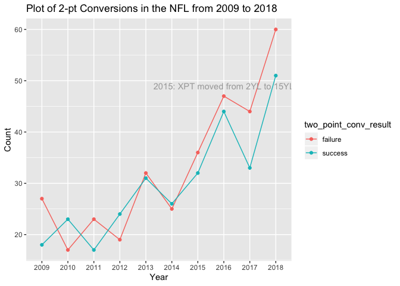
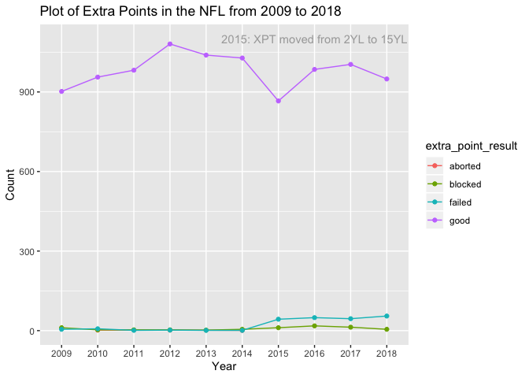

Loading the libraries needed
============================

    rm(list = ls())

    library(data.table)
    library(tidyverse)

    ## ── Attaching packages ───────────────────────────── tidyverse 1.3.0 ──

    ## ✓ ggplot2 3.3.0     ✓ purrr   0.3.3
    ## ✓ tibble  3.0.0     ✓ dplyr   0.8.5
    ## ✓ tidyr   1.0.2     ✓ stringr 1.4.0
    ## ✓ readr   1.3.1     ✓ forcats 0.4.0

    ## Warning: package 'tibble' was built under R version 3.6.2

    ## ── Conflicts ──────────────────────────────── tidyverse_conflicts() ──
    ## x dplyr::between()   masks data.table::between()
    ## x dplyr::filter()    masks stats::filter()
    ## x dplyr::first()     masks data.table::first()
    ## x dplyr::lag()       masks stats::lag()
    ## x dplyr::last()      masks data.table::last()
    ## x purrr::transpose() masks data.table::transpose()

    library(ggrepel)

Background about the data
=========================

Our project covers [NFL play-by-play data from 2009 to 2018 from
Kaggle](https://www.kaggle.com/maxhorowitz/nflplaybyplay2009to2016), and
we are using betting data from Kaggle (link to data here) to
contextualize the play-by-play data.     The [extra point yard
line was
moved](http://www.nfl.com/news/story/0ap3000000493347/article/nfl-moves-extra-point-to-15yard-line-for-2015-season)
from the 2-yardline to the 15-yardline in 2015 because the NFL wanted to
increase the number of 2-point conversion attempts to boast ratings. We
want to analyze how attempting more 2-point conversions, especially in
the 4th quarter, can benefit teams.

Data Cleaning
=============

[Follow this link for using an open source Git extension to deal with
versioning large files.](https://git-lfs.github.com/) This is how we
were able to load the large play-by-play dataset.

    nfl_data <- read_csv("NFLPlaybyPlay 2009-2018.csv")

    ## Parsed with column specification:
    ## cols(
    ##   .default = col_double(),
    ##   home_team = col_character(),
    ##   away_team = col_character(),
    ##   posteam = col_character(),
    ##   posteam_type = col_character(),
    ##   defteam = col_character(),
    ##   side_of_field = col_character(),
    ##   game_date = col_date(format = ""),
    ##   game_half = col_character(),
    ##   time = col_time(format = ""),
    ##   yrdln = col_character(),
    ##   desc = col_character(),
    ##   play_type = col_character(),
    ##   pass_length = col_character(),
    ##   pass_location = col_character(),
    ##   run_location = col_character(),
    ##   run_gap = col_character(),
    ##   field_goal_result = col_character(),
    ##   extra_point_result = col_character(),
    ##   two_point_conv_result = col_character(),
    ##   timeout_team = col_character()
    ##   # ... with 88 more columns
    ## )

    ## See spec(...) for full column specifications.

    ## Warning: 3240 parsing failures.
    ##  row                                col           expected      actual                          file
    ## 1081 pass_defense_2_player_id           1/0/T/F/TRUE/FALSE 00-0025828  'NFLPlaybyPlay 2009-2018.csv'
    ## 1081 pass_defense_2_player_name         1/0/T/F/TRUE/FALSE W.Woodyard  'NFLPlaybyPlay 2009-2018.csv'
    ## 1619 forced_fumble_player_2_team        1/0/T/F/TRUE/FALSE MIA         'NFLPlaybyPlay 2009-2018.csv'
    ## 1619 forced_fumble_player_2_player_id   1/0/T/F/TRUE/FALSE 00-0023408  'NFLPlaybyPlay 2009-2018.csv'
    ## 1619 forced_fumble_player_2_player_name 1/0/T/F/TRUE/FALSE G.Camarillo 'NFLPlaybyPlay 2009-2018.csv'
    ## .... .................................. .................. ........... .............................
    ## See problems(...) for more details.

    post_td_plays <- nfl_data %>% 
      select(play_id,
             game_id,
             home_team,
             away_team,
             posteam,
             posteam_type,
             defteam,
             posteam_score,
             defteam_score,
             score_differential,
             posteam_score_post,
             defteam_score_post,
             score_differential_post,
             desc,
             play_type,
             yards_gained,
             contains("two_point"),
             kicker_player_name,
             kicker_player_id,
             blocked_player_id,
             blocked_player_name,
             contains("extra_point"),
             wp,
             def_wp,
             home_wp,
             away_wp,
             wpa,
             home_wp_post,
             away_wp_post) %>% 
      mutate(year = substr(game_id, 1, 4)) %>%
      filter(extra_point_attempt == 1 | two_point_attempt == 1 | defensive_extra_point_attempt == 1 | defensive_two_point_attempt == 1)

    # Ratio of XPT:2PT attempts
    post_td_plays %>% 
      group_by(year, extra_point_attempt, two_point_attempt) %>% 
      summarise(n = n())

    ## # A tibble: 20 x 4
    ## # Groups:   year, extra_point_attempt [20]
    ##    year  extra_point_attempt two_point_attempt     n
    ##    <chr>               <dbl>             <dbl> <int>
    ##  1 2009                    0                 1    55
    ##  2 2009                    1                 0  1030
    ##  3 2010                    0                 1    46
    ##  4 2010                    1                 0  1138
    ##  5 2011                    0                 1    45
    ##  6 2011                    1                 0  1097
    ##  7 2012                    0                 1    54
    ##  8 2012                    1                 0  1193
    ##  9 2013                    0                 1    66
    ## 10 2013                    1                 0  1153
    ## 11 2014                    0                 1    55
    ## 12 2014                    1                 0  1137
    ## 13 2015                    0                 1    84
    ## 14 2015                    1                 0  1059
    ## 15 2016                    0                 1    93
    ## 16 2016                    1                 0  1125
    ## 17 2017                    0                 1    78
    ## 18 2017                    1                 0  1126
    ## 19 2018                    0                 1   120
    ## 20 2018                    1                 0  1092

Data Visualization
==================

    # 2-pt Conversion Distribution
    post_td_plays %>% 
      filter(two_point_attempt == 1) %>% 
      group_by(year, two_point_conv_result) %>% 
      summarise(n = n()) %>% 
      ggplot(aes(x = year, y = n, group = two_point_conv_result)) +
      geom_line(aes(color = two_point_conv_result)) +
      geom_point(aes(color = two_point_conv_result)) +
      annotate(geom="text", x='2016', y=49, label="2015: XPT moved from 2YL to 15YL", color="darkgray") +
      labs(title="Plot of 2-pt Conversions in the NFL from 2009 to 2018",x="Year", y = "Count")

    # XPT Conversion Distribution
    post_td_plays %>% 
      filter(extra_point_attempt == 1) %>% 
      group_by(year, extra_point_result) %>% 
      summarise(n = n()) %>% 
      ggplot(aes(x = year, y = n, group = extra_point_result)) +
      geom_line(aes(color = extra_point_result)) +
      geom_point(aes(color = extra_point_result)) +
      annotate(geom="text", x='2016', y=1100, label="2015: XPT moved from 2YL to 15YL", color="darkgray") +
      labs(title="Plot of Extra Points in the NFL from 2009 to 2018", x="Year", y = "Count")

Data Modeling
=============

    #str(post_td_plays)
    post_td_plays$posteam <- as.factor(post_td_plays$posteam)
    post_td_plays$defteam <- as.factor(post_td_plays$defteam)
    post_td_plays$play_type <- as.factor(post_td_plays$play_type)
    post_td_plays$two_point_attempt <- as.factor(post_td_plays$two_point_attempt)
    post_td_plays$two_point_conv_result <- as.factor(post_td_plays$two_point_conv_result)
    post_td_plays$kicker_player_id <- as.factor(post_td_plays$kicker_player_id)
    post_td_plays$extra_point_attempt <- as.factor(post_td_plays$extra_point_attempt)
    post_td_plays$extra_point_result <- as.factor(post_td_plays$extra_point_result)
    post_td_plays$year <- as.factor(post_td_plays$year)

    #str(post_td_plays)
    #summary(post_td_plays)

    # mod1 <- lm(wpa ~ posteam + defteam + score_differential + play_type + two_point_attempt + two_point_conv_result + kicker_player_id + extra_point_attempt + extra_point_result + year, data = post_td_plays)
